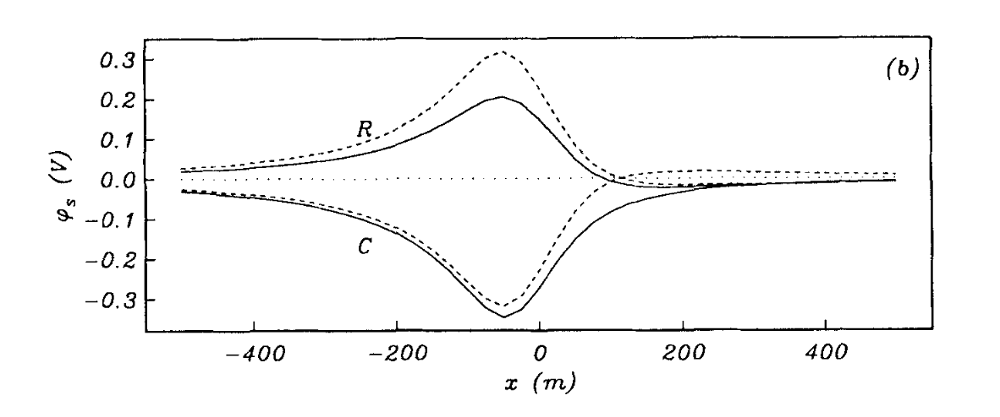

# Approximate inverse mappings in DC resistivity problems

_Yaoguo Li & Douglas W. Oldenburg_

[https://doi.org/10.1111/j.1365-246X.1992.tb00101.x](https://doi.org/10.1111/j.1365-246X.1992.tb00101.x)

## Summary

In an E-SCAN DC resistivity experiment a large amount of common source pole-pole potential data from many sources over a pre-designed survey grid are collected.

## Citation

Yaoguo Li, Douglas W. Oldenburg, Approximate inverse mappings in DC resistivity problems, Geophysical Journal International, Volume 109, Issue 2, May 1992, Pages 343–362, https://doi.org/10.1111/j.1365-246X.1992.tb00101.x
